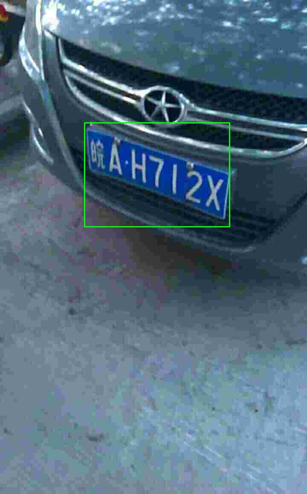
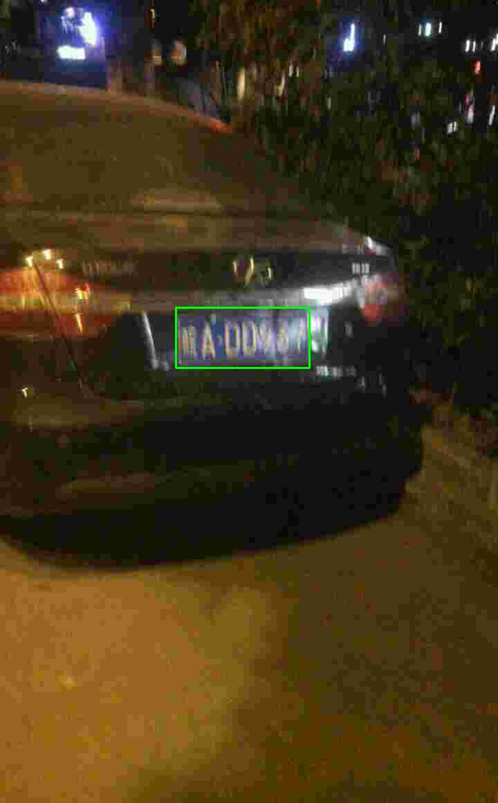
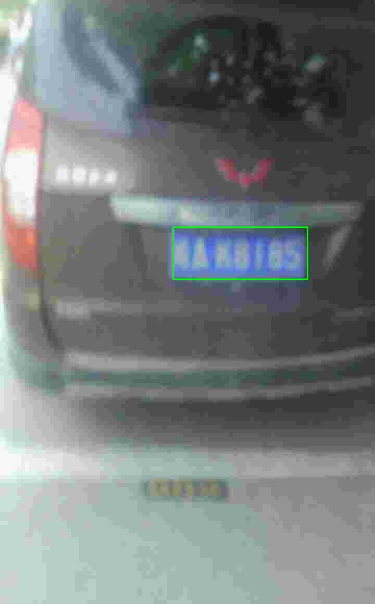
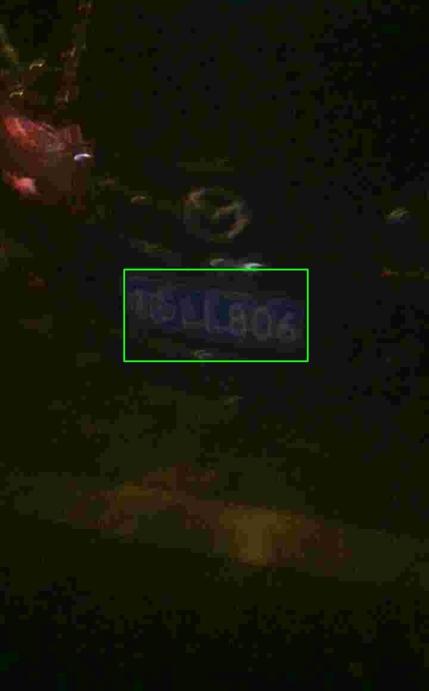
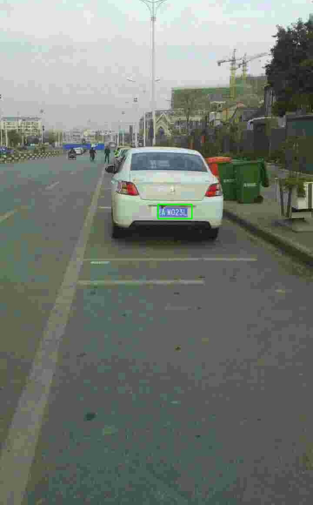
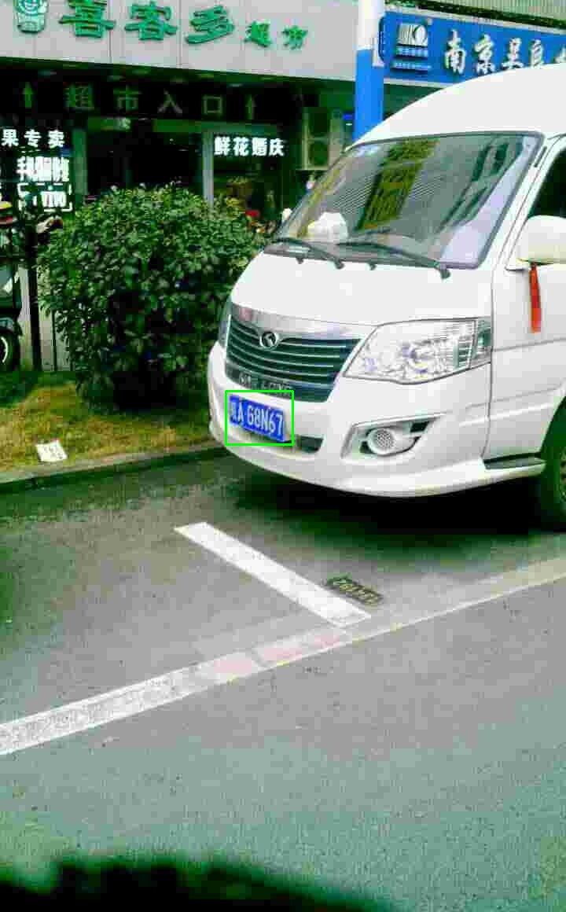
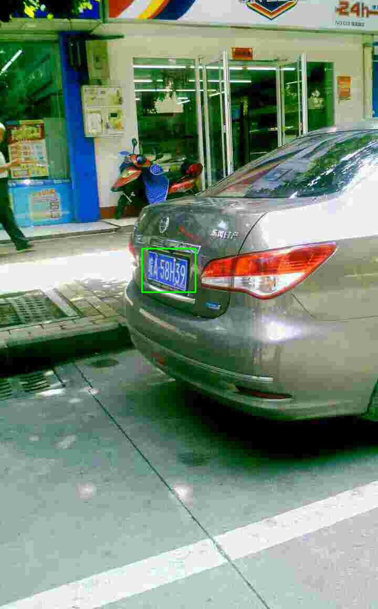

## License Plate (LP) Detection
We use the CCPD dataset introduced by paper [Towards End-to-End License Plate Detection and Recognition: A Large Dataset and Baseline](https://github.com/detectRecog/CCPD).

### Recent Update
* `2019.10.02` model v1 for CCPD dataset is released.
* `2020.03.27` model v1_small for CCPD dataset is released.(half parameters, much faster, much more friendly for edge devices)

### Brief Introduction to Model Version
* v1 - is designed for CCPD dataset, covering LP scale [64, 512]. It has 3 branches. Please check 
`./symbol_farm/symbol_structures.xlsx` for details.
* v1_small - the same as v1 but has less parameters, resulting much faster inference speed. Please
check `./symbol_farm/symbol_64_512_16L_3scales_v1_small.py` for details.

### Inference Latency

* Platform info: NVIDIA RTX 2080TI, CUDA 10.0, CUDNN 7.4.2, TensorRT 5.1.5.0

Model Version|320×240|640×480|1280×720|1920×1080|3840×2160|7680×4320
-------------|-------|-------|--------|---------|---------|---------
v1|0.62ms(1613.18FPS)|1.02ms(978.64FPS)|2.10ms(476.80FPS)|4.21ms(237.32FPS)|15.68ms(63.78FPS)|62.82ms(15.92FPS)
v1_small|0.52ms(1936.41FPS)|0.91ms(1093.00FPS)|1.70ms(586.58FPS)|3.39ms(294.72FPS)|12.12ms(82.51FPS)|47.67ms(20.98FPS)

* Platform info: NVIDIA GTX 1060(laptop), CUDA 10.0, CUDNN 7.4.2, TensorRT 5.1.5.0

Model Version|320×240|640×480|1280×720|1920×1080|3840×2160
-------------|-------|-------|--------|---------|---------
v1|0.86ms(1167.71FPS)|1.83ms(546.00FPS)|4.45ms(224.63FPS)|9.68ms(103.27FPS)|37.59ms(26.60FPS)
v1_small|0.67ms(1491.29FPS)|1.24ms(808.03FPS)|2.71ms(368.34FPS)|5.63ms(177.52FPS)|21.61ms(46.28FPS)

> CAUTION: The latency may vary even in the same setting.

### Accuracy on CCPD Dataset
We use the latest CCPD dataset, containing 351,974 images (it is larger than the version described in the paper).
**Since the train/test split is not provided by the paper, we randomly select 3/5 data for training and the rest is for test.**
We train v1 on the training set (211,180 images) and evaluate on the test set (140,794 images). 

#### Quantitative Results on Test Set
Average Precision (AP) is used for measuring the accuracy. In detail, we use code [Object-Detection-Metrics](https://github.com/rafaelpadilla/Object-Detection-Metrics)
for calculating the AP metric. The following table presents the results:

> `The comparison is not fair due to different traning/test split. This is for reference only!`
>
> `We make only one inference for each image in test. So some extremely large plates are failed to detect.`

Method|AP
--------|------
RPnet [1]|0.945
v1|0.989
v1_small|0.982

>[1] [Towards End-to-End License Plate Detection and Recognition: A Large Dataset and Baseline](http://openaccess.thecvf.com/content_ECCV_2018/papers/Zhenbo_Xu_Towards_End-to-End_License_ECCV_2018_paper.pdf)

#### Some Qualitative Results on Test Set
> Some challenging cases are presented.

### User Instructions
Please refer to [README in face_detection](../face_detection/README.md) for details.

### Data Download
Please visit [CCPD](https://github.com/detectRecog/CCPD) for accessing the data.